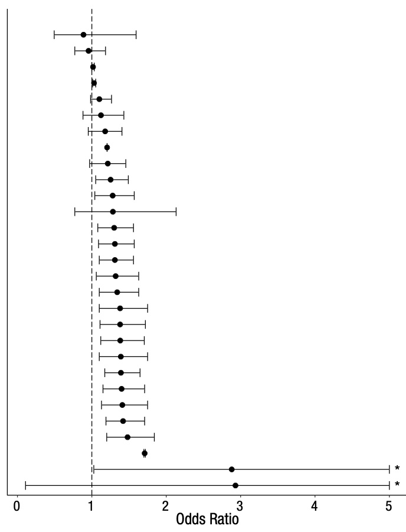

```{r xaringan-themer, include = FALSE, warning = FALSE}
library(xaringanthemer)
library(magrittr)
style_mono_accent(
  base_color = "#181714", 
  white_color = "#E8DFC0",
  base_font_size = "32px", 
  header_h1_font_size = "2.0rem",
  header_h2_font_size = "1.5rem",
  header_h3_font_size = "1.25rem", 
  header_background_content_padding_top = "2rem", 
  header_font_google = google_font("Lato"),
  text_font_google   = google_font("Montserrat", "300", "300i", "500"),
  code_font_google   = google_font("Source Code Pro"), 
  extra_css = list(".remark-code" = list("background" = "#DFDAB5 !important"), 
                   "p" = list("margin-block-start" = "0.5em", 
                              "margin-block-end" = "0.5em"), 
                   "ul" = list("margin-block-start" = "0.5em", 
                              "margin-block-end" = "0.5em"), 
                   "li" = list("margin-block-start" = "0.5em", 
                              "margin-block-end" = "0.5em"), 
                   "pre" = list("margin-top" = "0.5em", 
                              "margin-bottom" = "0.5em"),
                   ".bg-base" = list("background" = "#181714"),
                   ".caption" = list("display" = "none"),
                   ".compact-table" = list("font-size" = "0.5rem"),
                   ".small" = list("font-size" = "80%"), 
                   ".tiny" = list("font-size" = "50%")), 
  link_color = "#339944"
)
```

class: inverse, center, middle

# `r desc::desc_get('Title', '..')`
### `r rmarkdown::metadata$author`
### `r rmarkdown::metadata$institute`
### (updated: `r Sys.Date()`)

<script async src="https://platform.twitter.com/widgets.js" charset="utf-8"></script>
---

# About Research

Research is hard!

* projects are complex, take time, and can involve lots of people
* it is not easy to tell if you did the work correctly
  - sometimes you do an experiment, and the data don't mean anything
* many experts know how to do their specific kind of research, but lack general principles or effective practices

---
# Why be organized?

Be ready for situations, such as:
* changes in your project team
* half-finished projects that you now have time/resources/technology to complete
* recycling parts of your project for something else (maybe a follow-up or something completely different)

--

A consistent scheme for organizing your project will make your life easier!

---

# Learning Outcomes

By the end of the workshop, participants will be able to:

`r gsub("\n ", "\n", desc::desc_get("learningOutcomes"))`

---
class: inverse, center, middle

# Introduction to Reproducibility

---
# Hypothetical Example

Imagine you read a headline on social media "Scientists report that eating cheese reduces your risk of heart disease."

--
* What does this mean?

--
* How was the study carried out?

---
# Some possibilities

* An observational study of health and diet data from many subjects -- a statistically significant correlation is found between eating cheese and heart disease.
* A randomized controlled trial with a cheese-eating group and a control group, where heart health is measured.
  - are the subjects human? (or perhaps mice?)
* A biochemical study finds that an ingredient in cheese has an effect on chemical compounds related to heart disease.

---
class: center, middle

# Even simple statements can be challenging to interpret

---
class: split-two middle

# "Many Analysts"
## (Silberzahn et al. 2018)

.pull-left.w65[
29 teams of analysts were given the same data and research question:
* Are soccer referees more likely to give red cards to dark-skin-toned players vs. light-skin-toned players?

]
.pull-right.w35[
```{r, echo = FALSE, collapse = TRUE}
#| fig.alt =""

```
]

---
# The Importance of Methods

**Different analyses** of the **same data** yield **different results**.

* Which result is "correct"? (are any of them?)
* Which method is "correct"? (are any of them?)

--

**Reproducibility** is about ensuring others know how we got the answers we did.

--

_Only after this, can we begin to discuss which approaches are justified and which conclusions are supported._

---
# Unclear Instructions

```{r, echo = FALSE, out.width = "70%", fig.align = "center", fig.alt = "A clip from Schitt's Creek. A white male in his 30s in a white sweater with black stripes and a blue apron with pink flowers is stirring a pot in the kitchen. His mother, a white female in her 60s in a black dress and glasses is holding a small piece of paper, intended to be a recipe of some kind. The man has a skeptical look and is asking 'What does \"Fold in the cheese\" mean?'. The dialogue also appears in the clip as a caption."}
knitr::include_graphics("fold-in-the-cheese.gif")
```

---
# Missing Instructions

<blockquote class="twitter-tweet"><p lang="en" dir="ltr">2017: “Devices were fabricated as previously described [ref 8]” <br><br>[ref 8] 2015: “Devices were fabricated as previously described [ref 4]”<br><br>[ref 4] 2013: “Devices were fabricated as previously described [ref 2]”<br><br>[ref 2] 2009: “Devices were fabricated with conventional methods”</p>&mdash; Daniel Gonzales (@dgonzales1990) <a href="https://twitter.com/dgonzales1990/status/953737802205794304?ref_src=twsrc%5Etfw">January 17, 2018</a></blockquote>

---
class: inverse, center, middle

# Activity 1

---

# Setup

* you will need a drawing utensil 
  - pen, pencil, marker (anything will do)
* and something to draw on
  - any scratch paper, post-it, junk mail envelope (not too small that it's hard to draw on)

Digital is fine, if you prefer a phone/tablet device!

---

.small[
1. Draw 8/10 of a small oval in the center with the open part facing to the bottom left.
2. Draw 1/3 of a large circle underneath the oval and small perpendicular lines on each end of it.
3. At the center of the ⅓ circle, draw two squares with a small gap between them.
4. Draw a wavy line underneath the squares.
5. On the ends of the larger circle, draw smaller half circles with three dots in the middle.
6. Draw two big circles on each side of the small oval from the beginning. They should be more on the top than on the bottom.
7. In the big circles, draw smaller circles and in those draw even smaller filled-in circles.
8. Draw a wavy square around everything you drew so far.
9. Draw 7 small ovals within the space of the square.
]
 
---
class: center, middle

# Share your drawings!

---
# Summary

* Sharing methods details are necessary to justify conclusions.
* Sharing methods details that other people can follow is challenging!

---
class: inverse, center, middle

# File and Folder Organization

---

# Principles

* You don't want to spend time looking for stuff.
  Neither do your teammates
* Keep everything in **one** place.
  - project files (e.g. data, code, slides, report)
  - project information (e.g. team info, important links, project description, deadlines)

---

# Example Project Folder

<pre class = "hljs remark-code">
project/
├── data/
├── figures/
├── output/
├── paper/
├── R/
└── README.md
</pre>

--
* more examples in [Marwick et al. 2018 "Packaging Data Analytical Work Reproducibly Using R (and Friends)"](https://www.tandfonline.com/doi/abs/10.1080/00031305.2017.1375986)

---

# Practices

* Use sub-folders to organize data, figures, manuscript, etc.
  - separate raw data and processed data
* Use `README` files to document:
  - who did the experiments
  - when/how/why
  - data formatting
    (more on this later)

---
# A Project README

* short summary of project & goals
  - how would you introduce your project to someone new?
* guidance for interacting with the project
  - (software) how to install and run it
  - (paper) which file is the final report/paper
  - (data) the summary figure or main file
* funding acknowledgments / team members / how to cite

---
# Other project information

* Conversations about a project happen in other media (e.g. email, chat, verbal conversation)
  - be sure to record important info in your project folder!
  - *if it's not in your project folder, it isn't "real"*
* What information is important?
  - anything that affects decision making (e.g. what to do, which methods, deadlines)
  - links to external info (e.g. other projects, databases, references)

---
# Summary

* store project files and **project information** together in the same place
* make the project easy to engage with for someone not familiar with it
  - it is really easy to misremember details, especially for projects that you thought were "complete"
  
---
class: inverse, center, middle

# Naming Things

---
# Motivations

* You want to be able to see a list of filenames and understand their contents without having to open the files.
  - make it easy to find the file you need!
  - make it easy to see what is missing!

---

# Principles

Choose file names that:
* are machine-readable
* are human-readable
* sort nicely

---

# Examples (NOT SO GOOD)

<pre class = "hljs remark-code">
Hao's data with spaces & punctuation.xlsx
01.R
figure 1.png
fig 2.jpg
report-final FINAL HY-comments ver3.docx
</pre>

---

# Examples (BETTER)

<pre class = "hljs remark-code">
hao_table-of-punctuation-marks.xlsx
01_import-data.R
fig01_scatterplot_length-vs-interest.png
fig02_histogram_talk-attendance.png
yearly-report_2020-06-01_hy-comments.docx
</pre>

---
# Machine-Readable

* Avoid spaces, punctuation, accented characters, mixing CAPS and lowercase.
  - computers can struggle with these
  - simpler names help avoid confusion!
* Separate words with hyphens `'-'`
* Group words to organize files; separate groups with underscores `'_'`  
  (details and examples later)

---

# Human-Readable

* Use filenames that will help you find the right file later.
  - include a very short summary of the file contents if possible
* Use nouns for data objects and verbs for code:
  - `load-data.R`
  - `data_mtcars.csv`
  - `make-scatterplot.R`

---

# Using Default Ordering

* Files are sorted alphabetically by default.
  - we can make use of this!
* Left-pad with numbers to impose an order on files:
  - e.g. `01_load-data.R`, `02_process-data.R`
* Use RFC-3339 for dates:
  - `YYYY-MM-DD` format (alphabetical sorting makes it chronological, too!)

---

# Example

<pre class = "hljs remark-code">
siteA_2020-04-01_animal-count.xls
siteA_2020-05-01_animal-count.xls
siteB_2020-04-01_animal-count.xls
siteB_2020-04-01_weather.dat
siteB_2020-05-01_animal-count.xls
siteB_2020-05-01_weather.dat
</pre>

--
files are organized by site -> date -> data type

---

# Summary

* you probably use names to organize files already!
  - these tips can help improve your system
* be consistent in your naming scheme!
  - you may want to adjust your organization and names in the early stages of your project

---
# Data practices

* store raw data for reproducibility
  - copy and modify files instead
  - and/or use scripts to clean/wrangle raw data
* document your processing steps in code or text
  - someone else can see what processing was done, and reproduce it
  - OpenRefine is a great tool for cleaning messy data (and records the steps for you)!  
  https://uf-repro.github.io/OpenRefine-intro/

---

# Data processing

* Documenting what you are doing while you are doing it is tedious.
  - BUT it is the best way to record what you did so that others can understand why we observed specific outcomes.


---

# Data Dictionary

* define your rows and columns
  - e.g. do rows correspond to:
     + individual subjects
     + OR data collection sessions
     + OR individual samples from a measurement device
* define codes, categories, acronyms
* define relationships between multiple tables
* [provide metadata details](https://guides.uflib.ufl.edu/datamanagement/metadata)

---

# Example Data Dictionary

.compact-table[
|name|plot_name|group|description|type|
|--|--|--|--|--|
|mouse|Mouse|demographic|Animal identifier|text|
|sex|Sex|demographic|Male (M) or Female (F)|factor|
|sac_date|Date of sac|demographic|Date mouse was sacrificed|date|
|partial_inflation|Partial inflation|clinical|Indicates if mouse showed partial pancreatic inflation|logical|
|coat_color|Coat color|demographic|Coat color, by visual inspection|factor|
|crumblers|Crumblers|clinical|Indicates if mouse stored food in their bedding|logical|
|diet_days|Days on diet|clinical|Number of days on high-fat diet|numeric|
]

(modified from Figure 9 of Broman & Woo "Data Organization in Spreadsheets")

---
class: inverse, center, middle

# Activity 2

---

# In-Class Activity

Set up your project folder.

* what subfolders do you need?
* what info should you include in the project description?
  - which gene
  - what class is this for
  - who and when is this project being done

---
class: inverse, center, middle

# Summary

---

* These are general recommendations for organizing your projects!
  - You don't have to adopt all of these now. A lot will depend on your area of research and what works best with your teammates.
* If you find you are spending a lot of time doing tedious work...
  - there may be a better way!
  - Ask me about alternatives (for your current project or the future!) - haoye@ufl.edu
* Resources and other workshops that I teach - https://guides.uflib.ufl.edu/reproducibility

